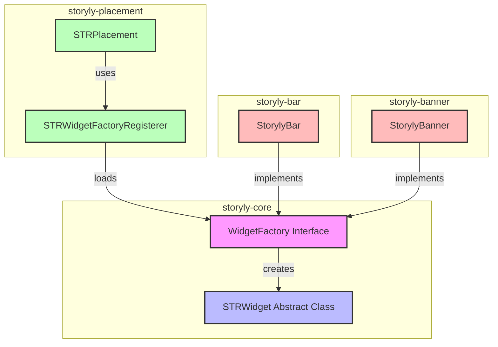

## SubModular Implementation

```mermaid
---
config:
  layout: dagre
---
flowchart TD
 subgraph s1["storyly-core"]
        A["WidgetFactory Interface"]
        B["STRWidget Abstract Class"]
  end
 subgraph s2["storyly-placement"]
        C["STRPlacement"]
        D["STRWidgetFactoryRegisterer"]
  end
 subgraph s3["storyly-bar"]
        E["StorylyBar"]
  end
 subgraph s4["storyly-banner"]
        F["StorylyBanner"]
  end
    A -- creates --> B
    C -- uses --> D
    D -- loads --> A
    E -- implements --> A
    F -- implements --> A
    style A fill:#f9f,stroke:#333,stroke-width:2px
    style B fill:#bbf,stroke:#333,stroke-width:2px
    style C fill:#bfb,stroke:#333,stroke-width:2px
    style D fill:#bfb,stroke:#333,stroke-width:2px
    style E fill:#fbb,stroke:#333,stroke-width:2px
    style F fill:#fbb,stroke:#333,stroke-width:2px

```
